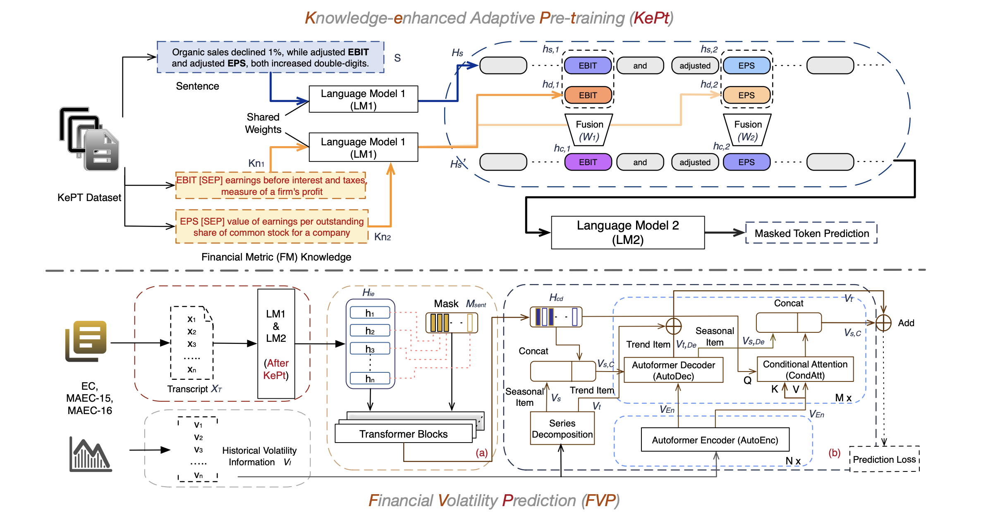

# KeFVP

Official implementation of ['KeFVP: Knowledge-enhanced Financial Volatility Prediction'](https://aclanthology.org/2023.findings-emnlp.770.pdf).

The paper has been accepted by **EMNLP-Findings 2023** 🔥.

## Abstract
Financial volatility prediction is vital for characterizing a company’s risk profile. Transcripts of companies’ earnings calls serve as valuable, yet unstructured, data sources to be utilized to access companies’ performance and risk profiles. Despite their importance, current works ignore the role of financial metrics knowledge (such as EBIT, EPS, and ROI) in transcripts, which is crucial for understanding companies’ performance, and little consideration is given to integrating text and price information. In this work, we statistically analyze common financial metrics and create a special dataset centered on these metrics. Then, we propose a knowledge-enhanced financial volatility prediction method (KeFVP) to inject knowledge of financial metrics into text comprehension by knowledge-enhanced adaptive pre-training (KePt) and effectively integrating text and price information by introducing a conditional time series prediction module. Extensive experiments are conducted on three realworld public datasets, and the results indicate that KeFVP is effective and outperforms all the state-of-the-art methods.

<div align="center">
  
</div>

## Requirements

### Installation
Create a conda environment and install dependencies:
```bash
git clone git@github.com:hankniu01/KeFVP.git
cd kefvp

conda create -n kefvp python=3.8
conda activate kefvp

pip install -r requirements.txt

```

## Dataset
### Raw Dataset
Please follow [README.md](https://github.com/GeminiLn/EarningsCall_Dataset) to download official EC datasets, and follow [README.md](https://github.com/Earnings-Call-Dataset/MAEC-A-Multimodal-Aligned-Earnings-Conference-Call-Dataset-for-Financial-Risk-Prediction) to download maec-15 and maec-16 datsets. 

### Tine Series
Price Data is stored in `price_data` folder.

### Dataset For KePt
Download from [kept_dataset](https://drive.google.com/drive/folders/1Xe7Y64F04X9GkWMOSZmSmpV1f5I1ySgM?usp=sharing), and place them in `kept_dataset` folder.

### KePt Pratrained Embeddings
Download from [kept_embedding_for_ec](https://drive.google.com/drive/folders/1F83bjiJKEpq_MYrc0lzQb9rOLgooz-5E?usp=sharing), and place them in `text_embedding` folder. Only for the EC dataset, the MAEC file is too large to be available.

## Get Started

### Running KePt

```bash
cd pretain
bash kept_run.sh
```
### Running KeFVP
```bash
cd kefvp
bash ./scripts/run_ec_for_kept.sh
```

## Acknowledgement
This repo benefits from [HTML](https://github.com/YangLinyi/HTML-Hierarchical-Transformer-based-Multi-task-Learning-for-Volatility-Prediction/tree/master), [VolTAGE](https://github.com/piyushkhanna00705/VolTAGE). Thanks for their wonderful works.


## Citation
```bash
@inproceedings{niu-etal-2023-kefvp,
    title = "{K}e{FVP}: Knowledge-enhanced Financial Volatility Prediction",
    author = "Niu, Hao  and
      Xiong, Yun  and
      Wang, Xiaosu  and
      Yu, Wenjing  and
      Zhang, Yao  and
      Yang, Weizu",
    editor = "Bouamor, Houda  and
      Pino, Juan  and
      Bali, Kalika",
    booktitle = "Findings of the Association for Computational Linguistics: EMNLP 2023",
    month = dec,
    year = "2023",
    address = "Singapore",
    publisher = "Association for Computational Linguistics",
    url = "https://aclanthology.org/2023.findings-emnlp.770",
    doi = "10.18653/v1/2023.findings-emnlp.770",
    pages = "11499--11513",
}
```

